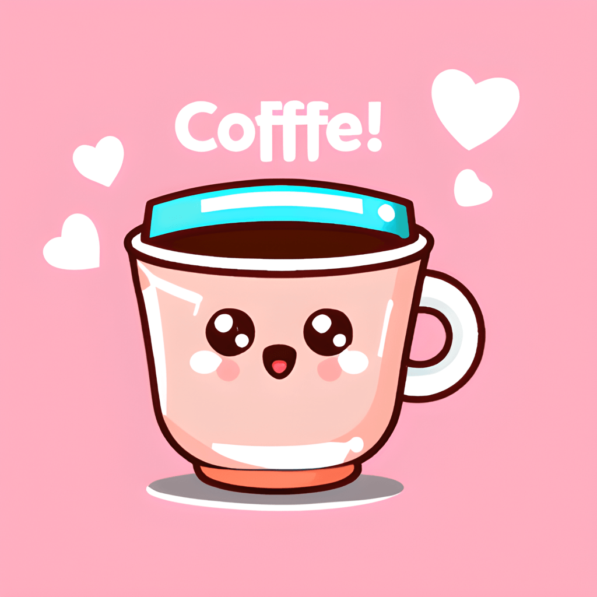

# ☕ Mochi & Bean

> **Sip happiness in every cup.**
> Handcrafted espresso, fresh pastries, and a cozy atmosphere waiting just for you.



## 📖 About The Project

**Mochi & Bean** is a delightful, responsive website designed for a boutique coffee shop. The project showcases a warm, inviting aesthetic that highlights the brand's commitment to ethical sourcing and fresh ingredients. 

From the "New Seasonal Menu" to the "Our Story" section, this landing page serves as a digital storefront for customers to browse the menu, learn about the brand's origins, and manage their orders via a functional shopping cart interface.

### 🌟 Key Features

* **Responsive Design**: Built with mobile-first principles to ensure a seamless experience on all devices.
* **Dynamic Shopping Cart**:
    * Add items to the cart.
    * Real-time total calculation.
    * **Local Storage Integration**: Remembers user cart data so it doesn't disappear on refresh.
* **Interactive Modals**:
    * **Terms & Support**: detailed house rules and intellectual property information.
    * **Privacy Policy**: Transparent data handling information.
* **Menu Showcase**: A curated list of favorites including Coffee, Pastries, and more.
* **Brand Story**: A dedicated section detailing the shop's history and values.

---

## 🛠️ Technologies Used

* **HTML5**: Semantic markup for accessibility and structure.
* **TailwindCSS**: Utility-first CSS framework for rapid, custom styling.
* **JavaScript (ES6+)**: Handles cart logic, modal interactions, and DOM manipulation.
* **Local Storage API**: Persists user state (cart items).

---

## 🚀 Getting Started

To get a local copy up and running, follow these simple steps.

### Prerequisites

* A modern web browser (Chrome, Firefox, Safari, Edge).
* A code editor (VS Code recommended) if you wish to make edits.

### Installation

1.  **Clone the repository**
    ```sh
    git clone [https://github.com/pyx-hash/Mochi-Bean.git](https://github.com/pyx-hash/Mochi-Bean.git)
    ```
2.  **Open the project**
    Navigate to the project folder and open `home.html` (or `index.html`) in your browser.

    > **Tip:** for the best experience, use a live server extension (like Live Server for VS Code) to serve the files.

---

## 📂 Project Structure

```text
Mochi-Bean/
├── assets/
│   ├── images/          # Hero logos, barista photos, product images
│   └── icons/           # Site favicons and UI icons
```

📜 Terms & Policies
House Rules
Welcome: By browsing, you agree to the site terms.

Usage: No illegal activities; please be kind.

Intellectual Property: Icons and photos belong to the creator. Personal sharing is allowed; commercial theft is not.

Privacy
Data Ingredients: We only collect name/email (for messages) and use Local Storage for the cart.

Usage: To process orders and improve experience. No data selling.

Rights: You can request to delete your data at any time via email.

👤 Author
Red Ixe Lacorte

Role: Designer & Developer

Support: redlienuexvane@gmail.com

📄 License
© All Rights Reserved. Designed by Red Ixe Lacorte.

This project is for educational and portfolio purposes.
├── home.html            # Main landing page
├── style.css            # Custom overrides (if applicable)
└── script.js            # Logic for cart and modals (inferred)
